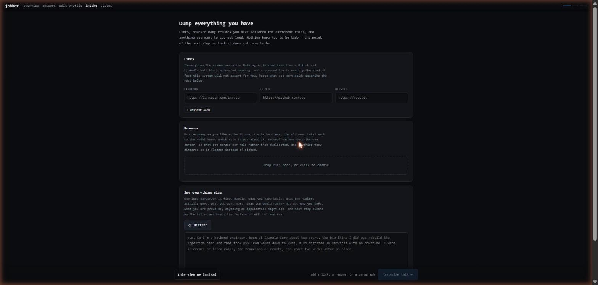
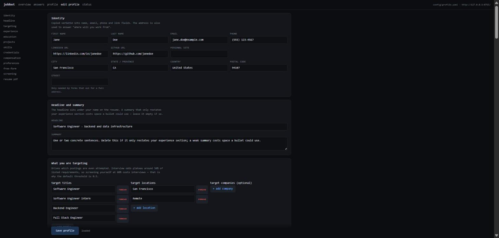

# jobbot

[](https://github.com/ShryukGrandhi/jobbot/actions/workflows/ci.yml)

An autonomous job-application agent. It finds roles on the boards companies
actually use, reads each application form with a vision model, tailors a
one-page resume, fills the form, verifies its own work against the rendered
page, submits, records exactly what it said, and texts you.

It is built around one rule:

> **The model may compose prose. It may never invent a fact.**

**Multi-App AI Agent Hackathon submission.** One agent, seven external
systems, three vision checkpoints, zero invented facts. Demo video: **[link
goes here]**. Demo script: [docs/DEMO.md](docs/DEMO.md).

---

## 1. Project overview

### The problem

Applying to jobs is a multi-app chore: find the posting on one site, create an
account on the company's ATS, wait for a verification email, tailor a resume,
answer forty screening questions, upload, submit, then track it all in a
spreadsheet. Every existing "auto-applier" fails the same two ways:

1. **It answers questions it was never told the answer to.** Work
   authorization, visa sponsorship, criminal history, background-check consent,
   veteran and disability status. A widely used open-source applier shipped
   hardcoded felony and background-check answers for every user until a
   reviewer caught it. A popular commercial extension defaults unknown yes/no
   screeners to "yes" and submits anyway.
2. **It reports success it cannot prove.** Tools routinely log "applied" for
   forms that never went through. A click is not a submission.

### What jobbot does instead

- Legally significant questions are answered **only** from a confirmed value
  in your profile. Missing one halts that application and names the field. A
  missing core one refuses to start the run.
- Nothing is recorded as submitted without **on-page evidence** read by a
  vision model after the click: a confirmation message or a reference number.
- Every statement made in your name lands in `data/answers.csv` with its
  source, confidence and rationale. Blanks say why they are blank.
- Every generated resume is diffed against your profile. Unknown employers,
  unknown titles, numbers absent from your source bullets, and skills you do
  not have all **block** the application.

### Pipeline

```
discover → dedup → ghost filter → fit filter          free, no browser
open tab → detect ATS → clear the account wall        cheap
CHECKPOINT 1  read every question off the rendered page   (vision)
knockout scan would an honest answer auto-reject you?
─────────────── only now does expensive work start ───────────────
build a portfolio project → tailor resume → render 1-page PDF
fill → CHECKPOINT 2  verify + heal loop → submit          (vision)
CHECKPOINT 3  did it ACTUALLY go through?                 (vision)
notify → ledger
```

Stage order is the design. Expensive, irreversible work happens only after the
form is known to be reachable and winnable. One published run generated
**2,019 tailored resumes to make 112 submissions** by doing this backwards.

---

## 2. External apps used

The agent reads from, writes to, or takes irreversible action in each of these.
The first three are enough to satisfy the brief; the rest are what makes it
actually work.

| # | System | What the agent does there | Code |
|---|--------|---------------------------|------|
| 1 | **Anthropic Claude API** (or Google Gemini) | Vision reads of every rendered form page, structured-output extraction of fields, resume tailoring and critique, profile intake from a messy dump. Prompt caching on the profile prefix. | `jobbot/llm/` |
| 2 | **Greenhouse, Lever, Ashby, SmartRecruiters, Workable** (public job-board JSON APIs) | Discovery. Pulls every open posting per company, no scraping, no auth. | `jobbot/discovery/sources.py` |
| 3 | **Workday** (myworkdayjobs.com) | Discovery via its search API, then the account wall: creates a per-tenant candidate account, waits for the verification email, signs in, carries the multi-step wizard to submission. | `jobbot/ats/workday.py` |
| 4 | **Oracle Cloud HCM** | Applies through its four-section flow, including the focus-and-Space trick its terms checkbox needs and a honeypot field it must not fill. | `jobbot/ats/oracle.py` |
| 5 | **Gmail API** (OAuth, `gmail.modify`) | Reads the one-time verification code Workday emails during account creation and marks it read. | `jobbot/mail/gmail.py` |
| 6 | **GitHub API** | Creates a real public repository per application, pushes a small portfolio project with real commit timestamps and a provenance line. Never during a dry run. | `jobbot/ghproj/` |
| 7 | **LinkedIn / Indeed** (via JobSpy) | Discovery only. A listing with no apply link is resolved to the company's own ATS board, which converts far better. Applying through LinkedIn itself is deliberately not automated. | `jobbot/discovery/aggregator.py` |
| 8 | **OS keychain** (macOS Keychain / Windows Credential Manager / Secret Service) | Stores every generated ATS password. Saved *before* the email round-trip so a half-verified account is recoverable. | `jobbot/ats/credentials.py` |
| 9 | **SMS / iMessage / webhook** | One message per submission with company, title, fit and ATS score. Falls through command → Messages.app → webhook → log so a notification failure never masks a result. | `jobbot/notify.py` |

Plus a stealth Chromium (CloakBrowser) that the agent drives to fill and
submit the actual forms.

---

## 3. Setup

Python 3.12+. [uv](https://docs.astral.sh/uv/) recommended.

```bash
git clone https://github.com/ShryukGrandhi/jobbot.git
cd jobbot
uv sync --extra dev

cp .env.example .env                                  # add ANTHROPIC_API_KEY
cp config/profile.example.yaml config/profile.yaml    # or use the intake wizard below

uv run jobbot check           # tells you exactly what is missing
uv run jobbot dashboard       # opens http://127.0.0.1:8765
```

`.env` needs one LLM key. `ANTHROPIC_API_KEY` is the supported path;
`JOBBOT_LLM_PROVIDER=gemini` with `GEMINI_API_KEY` also works end to end.

### Onboarding: build the profile from a dump

Open **intake** on the dashboard. Drop one or more resume PDFs, paste a
paragraph, or dictate. The model organises it into cards; you accept or correct
each one. The screening block (work authorization, sponsorship, criminal
history, and so on) is **never** filled by the model. Set it yourself in
**edit profile**.




### Discover, tick, apply

```bash
uv run jobbot discover --source greenhouse:anthropic --source ashby:openai --limit 10
```

Discovery ranks by fit and flags ghost postings, and writes the shortlist to
the dashboard **queue**. Tick the ones you want, blacklist the ones you are
handling yourself, then:

```bash
uv run jobbot run --source greenhouse:anthropic --approved --limit 3
```

`run` is a **dry run by default**. It fills and verifies everything and stops
before submitting. Add `--submit` only after reading `data/answers.csv`.

**It does not give up on an application.** A crash mid-form (a model call
that 400s, a menu that did not open, a navigation race) is retried *in the
same tab* with backoff until the application settles; `--attempts N` caps
it. A form that fills but will not verify clean gets three full passes. And
when the only thing left is a question only you can answer, the tab is left
**open** with the form filled, the CLI lists it, and waits for you. Nothing
you typed is thrown away.

### Optional integrations

- **Gmail** (Workday verification codes): create a Desktop-app OAuth client,
  enable the Gmail API, save the JSON to `~/.jobbot/gmail_client_secret.json`.
- **GitHub** (portfolio projects): `gh auth login`, then
  `uv run jobbot github-auth` once.
- **Notifications**: set `JOBBOT_NOTIFY_TO` plus `JOBBOT_NOTIFY_CMD` or
  `JOBBOT_NOTIFY_URL`. On a signed-in Mac, Messages works with nothing set.

Full detail: [docs/SETUP.md](docs/SETUP.md).

### Commands

```
jobbot check                    readiness: profile, llm, github, gmail, tracker
jobbot dashboard                local web UI: overview, queue, answers, intake, editor
jobbot discover --source ...    find and rank jobs, fill the queue, no browser
jobbot run --source ... [--approved] [--submit] [--persist] [--keep-open]
jobbot report <audit-dir>       every answer entered, field by field
jobbot ats-test --pdf x.pdf     score a resume, optionally against a live parser
jobbot github-auth              one-time consent to create repos
jobbot stats
```

Sources: `greenhouse:slug`, `lever:slug`, `ashby:slug`, `smartrecruiters:slug`,
`workable:slug`, `workday:tenant/site/pod`, `interns:simplify`,
`linkedin:search terms`.

---

## 4. Reliability testing

**25% of the score is reliability, so here is exactly how this was tested.**

### Unit suite: 82 tests, runs in 2 seconds, no network

```bash
uv run pytest -q
```

| File | What it pins down |
|------|-------------------|
| `tests/test_regressions.py` | 40+ regressions caught on real runs: an application is retried in its own tab until it settles and a needs-you result keeps its tab open; the healer re-applies a confirmed consent value and snaps decline wording; the persistent browser context survives its last tab closing; a refused submit is not "submitted"; a Workday step that did not advance is not reported as advanced; a rate limit is not retried into a longer one; API silence is bounded at 120s; a stale browser lock is cleared and a live one is named; every module imports what it uses (the `asyncio`-undefined class of bug that once threw away two filled applications). |
| `tests/test_llm_errors.py` | A plain 429 is retried, not treated as quota exhaustion. Failover only to a backend that has a key. |
| `tests/test_fit_score.py` | Postings with no description (Workday) are scored on title, not filtered out wholesale. |
| `tests/test_selector_quoting.py` | Option labels with apostrophes ("Bachelor's Degree", "I don't wish to answer") produce valid selectors. |
| `tests/test_intake.py` | Dump → cards → patches: the model's proposal is applied field by field and never touches the screening block. |
| `tests/test_editor.py` | Profile form round-trips through YAML losslessly; validation rejects bad state. |
| `tests/test_queue.py` | Blacklist survives re-discovery; approved outranks fit; applied stops re-offering. |

### CI on three operating systems

`.github/workflows/ci.yml` runs the suite on Ubuntu, macOS and Windows on
every push and pull request, then runs the dashboard self-check and parses the
CLI. The Windows leg exists because the first merged tree could not even
import there (`fcntl`, `os.kill(pid, 0)` which *terminates* on Windows, and
cp1252 file reads). All three are fixed and pinned.

### Dashboard self-check

```bash
uv run python -m jobbot.dashboard
```

Renders every view against a realistic on-disk fixture and then attacks the
static-file path guard with `../`, URL-encoded traversal, absolute paths and a
symlink out of `data/`. All must be refused.

### End-to-end spec against the real world

```bash
JOBBOT_E2E=1 uv run pytest tests/test_smoke_e2e.py -v -s
```

`tests/test_smoke_e2e.py` drives the real HTTP server, calls the real model,
hits real job boards, launches the real browser, and asserts only on what lands
on disk: every endpoint answers, a resume's text is extracted, a dump is
organised into cards, accepting them saves a whole profile, setting screening
clears preflight, discovery finds and ranks jobs, and a dry run fills one real
posting and records every answer. It is skipped by default because it needs a
key, a GUI and several minutes. It never passes `--submit`.

### Verified live during this submission (real employer form, dry run)

A full dry run against a live Anthropic posting on Greenhouse, on Gemini
2.5 Pro, from this Windows machine:

| Stage | Result |
|---|---|
| Checkpoint 1 (vision parse) | 26 fields, 12 required, 15 page tiles |
| Resume tailor + critique | fabrication check **rejected** an invented "90%" the model added; final ATS score 69.5, fits one page first try |
| Fill | 20/26 fields; Country, sponsorship, EEO answers all from the profile, decline options via synonym match |
| Checkpoint 2 (vision verify) | 5 blockers found, including an arbitration consent that did not take |
| Heal | now re-applies the confirmed profile value and snaps "I do not wish to answer" to "Decline To Self Identify" |
| Ledger | 26 rows in `answers.csv`, every one with source and confidence |

Four bugs were found only by running it live, each now fixed and pinned by
a test: a Windows-only browser-context death, a Gemini schema rejection, a
missing import in the tracker lock, and a healer that refused to re-apply
the candidate's own consent answer.


- Discovery against Greenhouse (Anthropic) and Ashby (OpenAI): 1,390 postings
  ranked in under 10 seconds, ghost flags present.
- Dashboard: overview, queue, intake, editor, status, and every API route
  served on Windows 11 / Python 3.12.
- All four feature PRs (#10–#13) merged with zero conflicts; the seven small
  fixes they superseded were grep-verified present on `main` before closing.

### Design-level reliability

- **Fail closed.** The verifier treats anything it cannot see as unfilled.
  Capture tiles the whole page (Chromium's 16,384px texture cap silently
  truncates `full_page=True`).
- **Audit trail per application** in `data/applications/<job>/`: form JSON,
  every answer with provenance, verification result, screenshots at each
  checkpoint, the rendered resume, the fabrication report.
- **Idempotent writes.** Both CSV ledgers are written via temp file + atomic
  replace under an exclusive lock, on POSIX and Windows.
- **Conservative defaults.** Dry run. Three tabs. Paced delays. Per-company
  cap. No repo creation on a dry run.

---

## 5. Demo video

**[Link goes here — under two minutes]**

Storyboard and recording checklist: [docs/DEMO.md](docs/DEMO.md).

---

## What the evidence says to optimize

Ranked by measured effect size:

1. **Referrals.** Application→interview is **40% vs 3%** inbound. This tool
   deliberately does not automate outreach; automated sending violates
   LinkedIn's terms.
2. **Apply on the company career site**, not the aggregator: 34% of hires from
   24% of applications, versus 23% of hires from 50% via job boards. This is
   why LinkedIn listings are resolved to the company's own ATS.
3. **Filter for fit, then apply broadly.** Interview odds plateau around 50% of
   listed requirements. Self-screening at 80% costs interviews.
4. **Route around silent killers**: >6-month gaps (~48% auto-screen),
   sponsorship, dropdown salary fields.

Myths deliberately not encoded: *"75% of resumes are rejected by ATS"* (a 2012
sales pitch), keyword-density scoring (no ATS vendor documents it), and
"apply within 24 hours" timing claims (one vendor blog, n≈1,610).

## Risks, stated plainly

- **Automated submission violates the terms of service** of LinkedIn, Indeed
  and most ATS platforms. Defaults are conservative, but the account risk is
  yours.
- **LinkedIn is deliberately not automated** for applying. It has documented
  account bans and government-ID demands for exactly this.
- **Employers are reacting.** Greenhouse ships fraud detection with identity
  verification. Volume is not a strategy.
- **Read what it wrote before you trust it.** `data/answers.csv` contains
  every statement made in your name.

## Architecture

[docs/ARCHITECTURE.md](docs/ARCHITECTURE.md). The seam that matters: the
answering layer speaks in `FormField` and `ProposedAnswer` and never sees a
DOM element, so selector rot is confined to one adapter per ATS and the model
cannot misidentify a control.

## Team

Shryuk Grandhi — shryukgrandhi@gmail.com

## License

MIT. See [NOTICE.md](NOTICE.md) for third-party credits.
